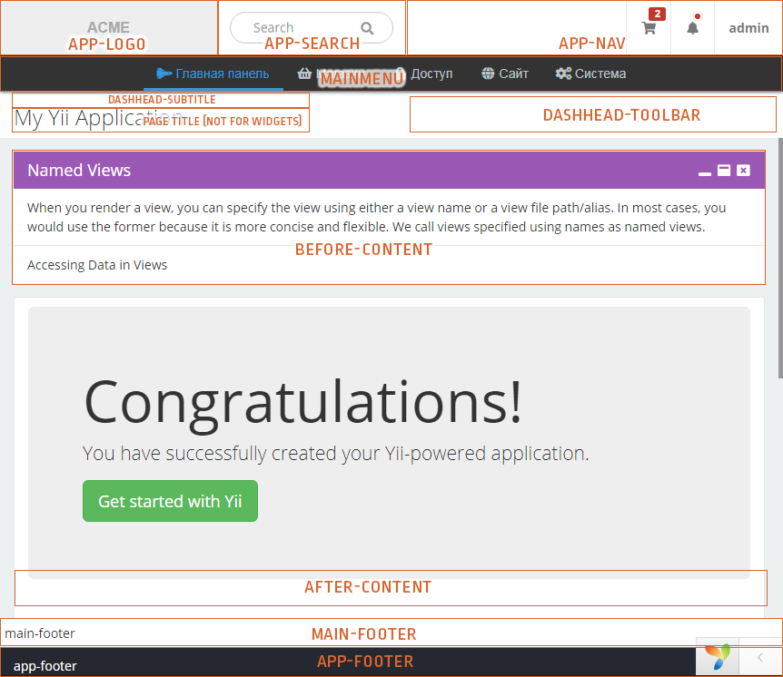
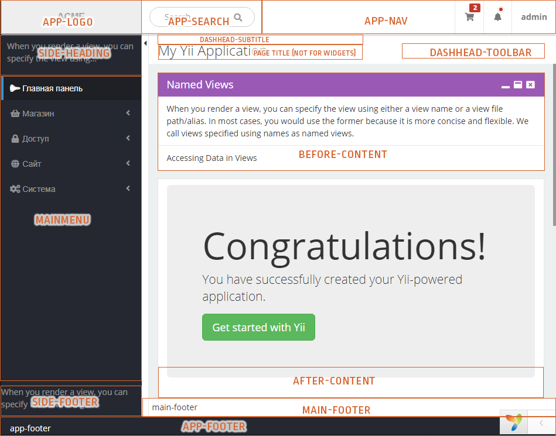
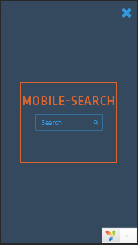

Yii2 extension for Chaldene Admin Template
=====================================

The extension adds support for the [Chaldene Admin Template](http://chl.onokumus.com/) markup.

This extension includes easy applicable asset bundles, HTML layouts and basic widgets.

Installation
---
Your best CLI-friend will help you with this:

`composer require mikbox74/yii2-chl`

Starting the party
---

For beginning you must configure `view` components:

```php
return [
    //...
    'components' => [
        'view' => [
            'class'   => \mikbox74\Chaldene\ChaldeneView::class,
            //...
        ],
    ],
    //...
];
```

The `mikbox74\Chaldene\ChaldeneView` overrides system layout path and makes some nice magic. For more magic you can use following properties:

*   *layout* (string) - one of the three layout types: `topnav` (main menu on top), `sidenav`, `sidenavhf` (main menu at left). It's strongly recommended to use suitable constants from `mikbox74\Chaldene\ChaldeneLayouts`.
*   *fixPage* (boolean) - makes `app heading` and `app footer` fix while you scroll the page.
*   *fixSide* (boolean) - makes `side heading`, `side footer`, `app heading` and `app footer` fix while you scroll the page.
*   *fixMain* (boolean) - makes `main heading`, `main footer`, `app heading` and `app footer` fix while you scroll the page.
*   *boxed* (boolean) - limits the width of the page.
*   *showTitle* (boolean) - Show the page title inside `main heading` panel.
*   *rtl* (boolean) - Right to left content direction.
*   *widgets* (array) - Config array where in you can explain how some widgets must be placed inside the view.

More about widgets placement
---
I recommend to set up the widgets in special file:


```php
return [
    //...
    'components' => [
        'view' => [
            'class'   => \mikbox74\Chaldene\ChaldeneView::class,
            'widgets' => require 'widgets.php',
        ],
    ],
    //...
];
```

widgets.php:

```php
return [
    'app-logo' => [
        'widget1',
        'widget2',
        'widget3',
        //...
    ],
    'mainmenu' => [
        'widget1',
        'widget2',
        'widget3',
        //...
    ],
    'app-search' => [
        //...
    ],
    //...
];
```

The first level is an associative array with the pairs 'place name' => 'widgets list in this place'.

The template have following places:

*  app-logo
*  mainmenu
*  app-search
*  app-nav
*  dashhead-subtitle
*  dashhead-toolbar
*  before-content
*  after-content
*  main-footer
*  app-footer
*  side-heading (only `sidenav` and `sidenavhf` layouts)
*  side-footer (only `sidenav` and `sidenavhf` layouts)
*  mobile-search (visible on small screens after pushing search button)

Next level is the plain list of widgets. Every widget can be configured by three ways:

1. Plain text string. It will be placed right inside without any changing.
2. Configuration array with 'class' element and any properties of the specified class (Yii-way).
3. Anonimous function returns a class configuration array (like above).

In brief about widgets
---

*  `mikbox74\Chaldene\Widgets\AlertNavitem` - created to view some important information with icon, badge and dropdown list of messages. Add it in place inside _UL_ menu and be happy.
*  `mikbox74\Chaldene\Widgets\Box` - views content inside nice blocks (same as TWBS panes but little mode advanced).
*  `mikbox74\Chaldene\Widgets\Breadcrumbs` - crumbles everywhere on your site.
*  `mikbox74\Chaldene\Widgets\Logo` - shows your (or our) logo image in two wariants: small for mobiles and larger for other screens.
*  `mikbox74\Chaldene\Widgets\Message` - a twin of `\common\widgets\Alert` from the Yii2-advanced app skeleton. It appears automatically and not need to be added in any place.
*  `mikbox74\Chaldene\Widgets\MetisMenu` - this is the pop king in town. Add it wherever in you want to see awesome adaptive multilevel menu.
*  `mikbox74\Chaldene\Widgets\SearchForm` - simple little search form with input and knob.
*  `mikbox74\Chaldene\Widgets\UserNavitem` - can view a nav item with user avatar, username and dropdown user menu. Works properly inside *UL* tag (same as `AlertNavitem`)

Much more info see in DocComments.

Handsome cheatsheet
---

### Top navigation ###



### Side navigation ###



### Mobile search ###


